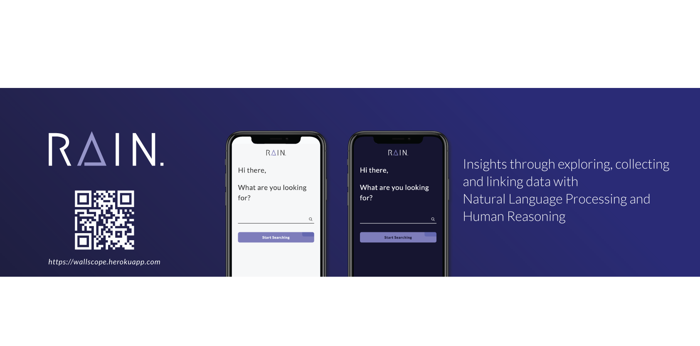

# Rain

[🚀 Live demo 🚀](https://wallscope.herokuapp.com/)

## Description

The Rain platform helps medical students and researchers with their research of medical data pieces.
Rain does this, by providing a way to store their found datasets and articles (in a so called _board_), while also providing the ability to link these pieces of data to each other, when they have something in common.
When working on a board, one can decide to collaborate on a board, allowing other users to also access and modify this shared board.

The idea of Rain is to not only help people who create an account, but also serve those that just want to look up something real quick. This then only shows the results, without the ability to store them in boards.

This project is a collaboration between [Chelsea Doeleman](https://github.com/ChelseaDoeleman), [Jesper Ingels](https://github.com/JesperIngels), [Maikel Sleebos](https://github.com/Senpaizuri) and [Maikel van Veen](https://github.com/maikxx).

## Table of contents

1. [Installation](#Installation)
2. [Briefings](#Briefings)
3. [Progress](#Progress)
4. [Design Rational](#Design-Rational)
5. [Poster](#Poster)
6. [License](#License)

## Installation

* Make sure to install [yarn](https://yarnpkg.com/en/) or [npm](https://www.npmjs.com)
* Make sure the **port** specified in the [package.json](package.json) is available (defaults to 9000)
* Clone the repository: `git clone git@github.com:Maikxx/360-wallscope.git`
* Navigate into the directory: `cd 360-wallscope`
* Install dependencies: `yarn` or `npm install`
* Install PostgreSQL: `brew install postgresql`
* Create the database: `createdb wallscope`
* Copy the environment variables: `cp ./.env.example .env`.
* Start the backend development server with: `yarn start-server` or `npm run start-server`
* Start the clients development server with: `yarn start-client` or `npm run start-client` in another terminal window.
* Run tests with `yarn test` or `npm run test`.

You may have perform the following steps if you get errors running the commands above:

* `npm install typescript -g`
* `npm install ts-node-dev -g`
* `npm install parcel-bundler -g`

The port that now opens is `localhost:9000`.

We also set up a [Version control](./docs/guidelines/VERSION_CONTROL.md) for working with Git in a project with this many people.

## Briefings

1. [Briefing 1](./docs/BRIEFING_1.md)
2. [Briefing 2](./docs/BRIEFING_2_WALLSCOPE.md)
3. [Briefing 3](./docs/BRIEFING_3.md)

## Progress

To view our progress, please visit our [GitHub project page](https://github.com/Maikxx/360-wallscope/projects/1).

In the second to last week of the project we also did a user test. You can read more about it [here](./docs/USER_TEST.md).

## Design Rational

You can find this [here](./docs/DESIGN_RATIONAL.md).

## Poster

The poster for the exposition can be found [here](./docs/poster/Poster-final.pdf).

## License

This repository is licensed as [MIT](LICENSE) by [Chelsea Doeleman](https://github.com/ChelseaDoeleman), [Jesper Ingels](https://github.com/JesperIngels), [Maikel Sleebos](https://github.com/Senpaizuri) and [Maikel van Veen](https://github.com/maikxx).