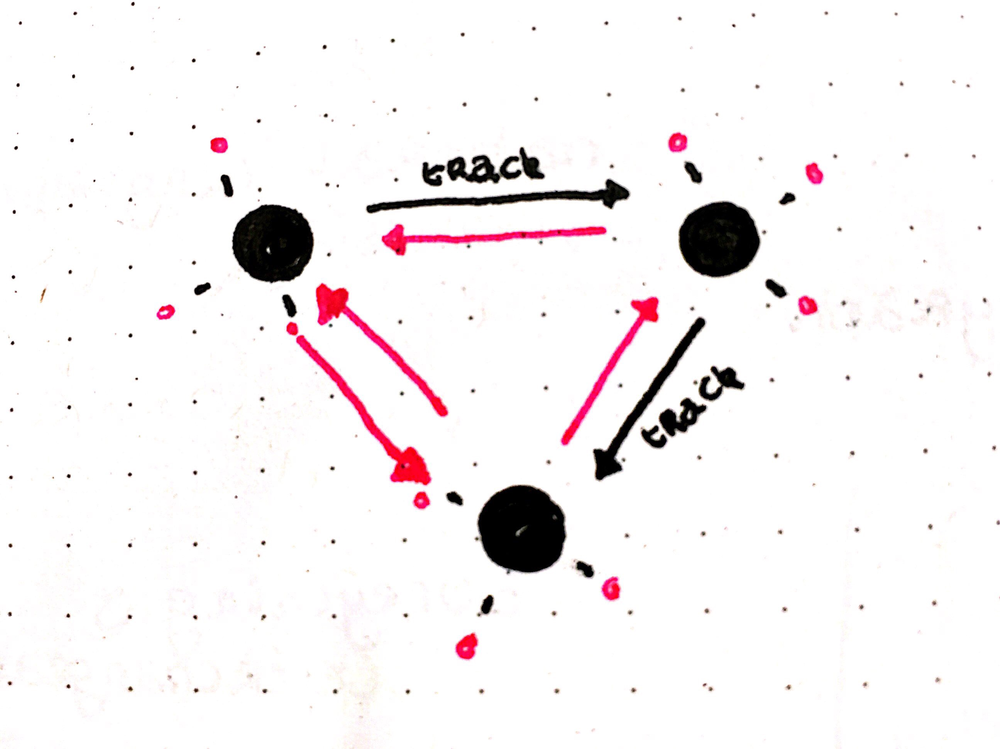

# BRIEFING I

**All data is accessible through one point.**

## Linked Data - Conceptual model
* Search Engines
    * set of properties to structure data schema.org
* Content Delivery
* Voice assistants
* Casebook - medical records

## Resource Description Framework RDF - Concrete implementation of Linked Data
* URI
* SPARQL
    * query access along multiple databases
* Natural language processing

## Triple - DBpedia
* Subject - actor
* Predicate - action
* Object - “destination”

* Entity
* Property
* Prefix
* Everything  is interchangeable

## Graph
Links also have a type data describes itself (child properties)

## HiCCUP - Interface to query linked data

Endpoints
* /enhance/default
* /enhance/entity - full information -> Meta data

**! FRIDAY**
Small presentation - show some ideas, concepts, etc.

* The Curious
    * The average customer when they’re looking for something.
* The Focused
    * Focus on geographical level, how are we doing compared to other companies.
* The Detailed
    * Know their way around data, don’t know how to grab a spreadsheet style file and create it.
    * Know what they want academically, but not how to create it because it probably wasn’t their major.
* The Diggers
    * Want Raw data, download files, do whatever they want with it.

* Multi-user support would be nice, since at this moment in the current system that just does not work. The company starts to notice that having a single platform for multiple users is very difficult.
* People call the company for data, since the website is not clear enough.
* People use spreadsheets in order to avoid the system.
* ISD is the data provider.

Most important groups to focus on in this appication:
* Focused
* Detailed

**The Detailed and The Focused persona’s are the most interesting, because the data can be meaningful to them in the future.**

Linked data
* Diggers linked stuff from this website to another dataset by linking it, to make a comparison.
