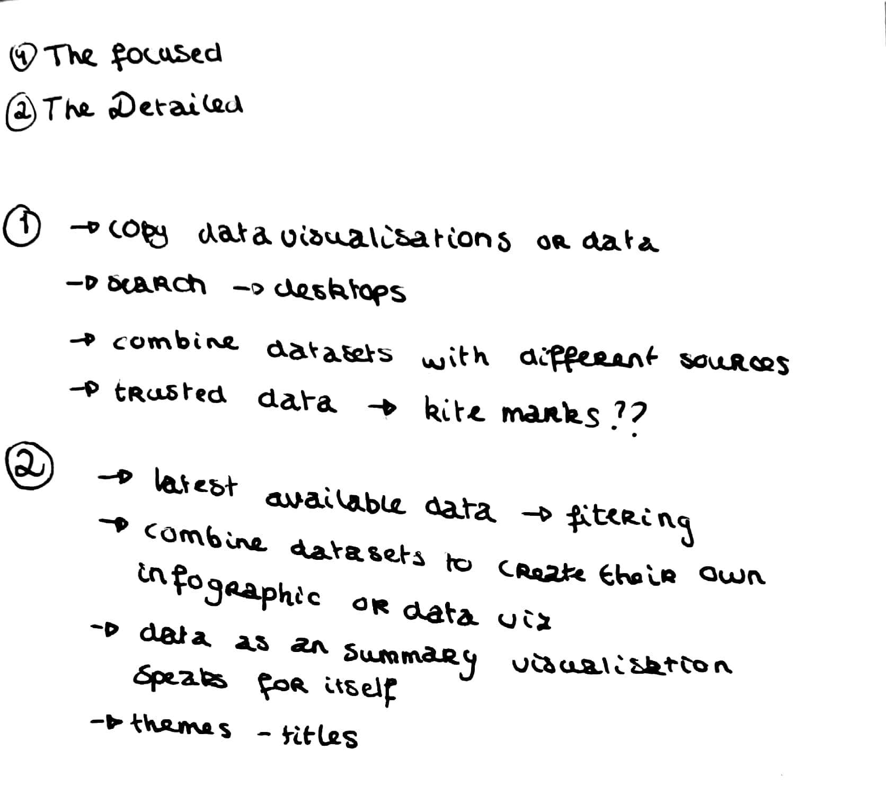
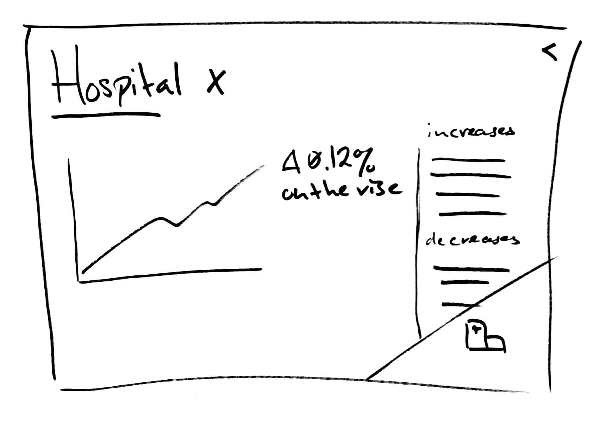

# Briefing 2 - Wallscope

## Concepts

* ~~Create a chatbot for users to talk to in order for the system to know what the user wants to know from the system.~~
* Create a search field that that also accepts search queries in the form of SparQL. This could also result in textual articles being generated from the results, as well as a generated datavisualization.
* Log in system to make it possible to change the tone of voice of the articles generated by the system for unique users. (**Nice to have**)
* Create visualizations based on location to increase relevance.
* Merge multiple datasets.
* Add the ability to embed a generated graph on other sites, as well as enable sharing.
* Add autocompletion in the search field.

## Brainstorming

* How can we avoid presenting "invalid data" to end users. (Use of different data sources). -> ?
* Do we have multiple data sources? -> Yes
* Is there already some form of 'storytelling' in the current application? -> No

