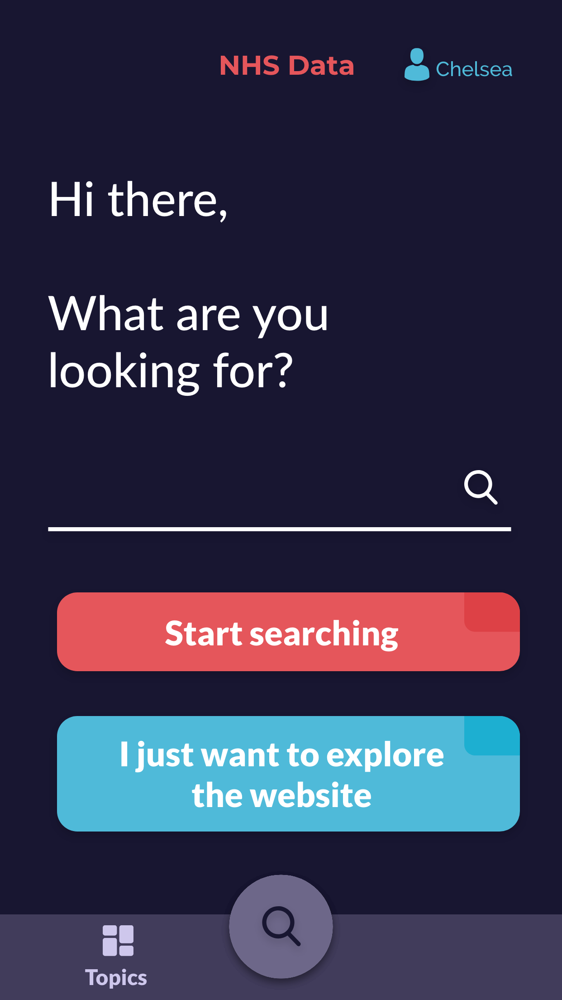
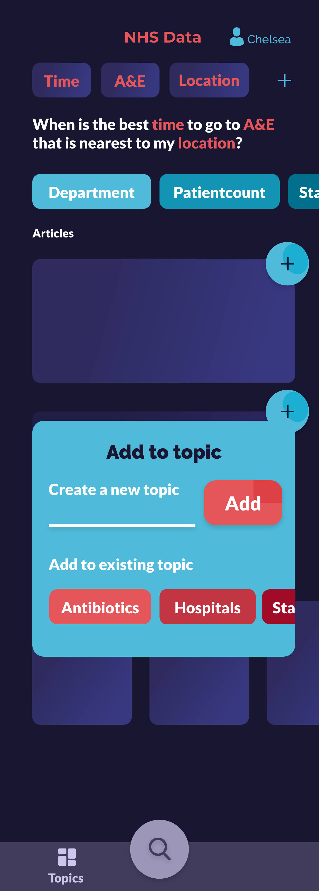
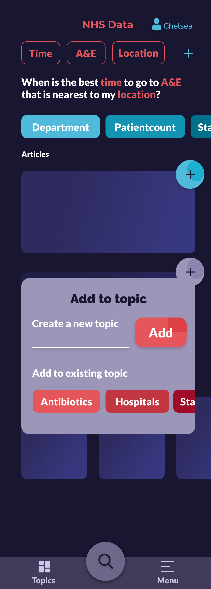
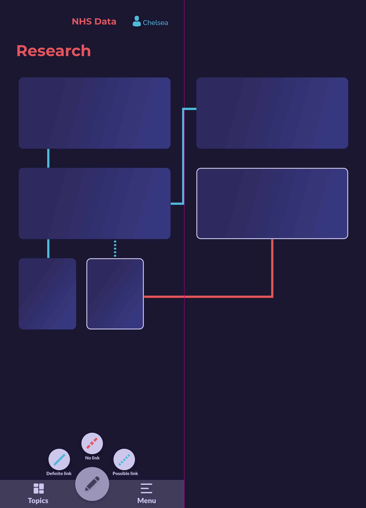

# Briefing 3

After speaking to Joost about our concept so far we got to the conclusion that we took the project too broad.
We then brainstormed together to find a more narrow branch in this broad scope.

We decided to each concept some screens in Adobe XD to see how our thoughts vary from each other.

    
Version 2 @Maikel Sleebos

    
Version 2 @Chelsea Doeleman

    
Version 2 @Maikel van Veen

    
Version 3 @Chelsea Doeleman and Adobe XD file

