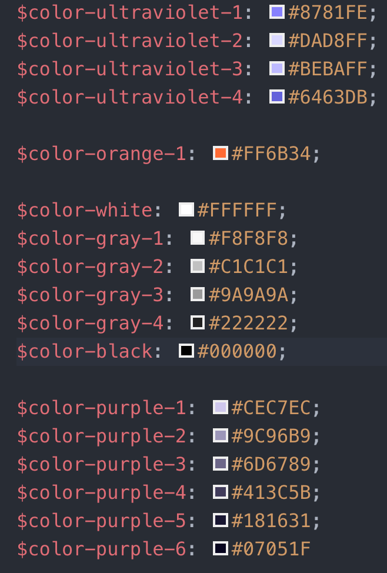
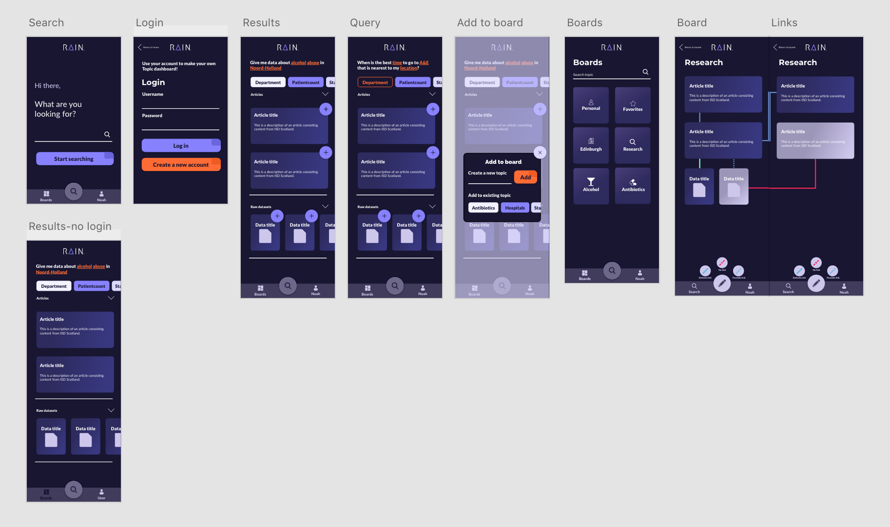

# Design Rational

## Table of Contents
* [Debriefing](#Debriefing)
* [Problem definition](#Problem-definition)
* [User Goal](#User-Goal)
* [Stakeholders](#Stakeholders)
* [Context](#Context)
* [Sub-questions](#Sub-questions)
* [Design challenge](#Stakeholders)
* [Design decisions](#Design-decisions)
    * [Branding](#Branding)
    * [Colors](#Colors)
    * [Typography](#Typography)
    * [Screens](#Screens)
    * [Feedback](#Feedback)
* [Explanation of the code](#Explanation-of-the-code)
    * [Structure](#Structure)
* [Conclusion and our Advice](#Conclusions-and-our-Advice)

## Debriefing

Together with **Wallscope**, **Information Services Division** (ISD) wants to improve their website so that users are able to easily look up data on their platform. The ISD has four target groups, The Curious, The Detailed, The focused and The Diggers.

**The Curious** are not sure what they want yet and are drawn in by ideas. They mainly want an unbiased point of view.
**The Detailed** want to fully understand an issue, to connect all the dots to improve the system.
**The Focused** know what they want and want easy access to it.
**The Diggers** need raw data, to conduct their own research and connect the unconnected.

ISD is an open data source that provides their users with data about health information, health intelligence and statistics. This in cooperation with **NHS Scotland**.
Together with Wallscope they want to link data to one another, so that users are able to easily access the data on the ISD platform.

Wallscope creates links in the dataset by creating triples.
A triple creates a link between two entities by having a reference in the middle.
The database uses **RDF** (Resource Description Framework), which represents data as statements. One statement is composed of one triple: the subject → predicate → object. How would that look like? Example:
`(subject)John → (predicate)Has mother → (object)Heather`. So the statement is that John has a mother named Heather.

By using these triples it is possible to present the user more targeted search results, so that users aren't overwhelmed by all the data that ISD has at their disposal.

Wallscope and ISD would like to see an improved version of the current ISD website, where the user is able to look up information by using natural language search terms. As a result the users are able to create links between data to underpin their research.

## Problem definition

Users can't find what they are looking for when searching through the data with the ISD website.
They don't understand all the different tables and input fields that have to be filled in before they even get any results.
This bad user experience results in the fact that none of the four target groups are able to find what they are looking for in the way they want to look for it.

## User Goal

A good user goal to test is the application flow, and if all the functionalities of the application make sense to the target audience.

## Stakeholders

* **NHS Scotland**
    Provide data in cooperation with ISD.
* **ISD Scotland**
    Provide data to the users, through their online platform.
* **Wallscope**
    Create solutions, to make data more manageable. So that users do not get lost in a maze of data, but are able to retrieve this easily.
* **The Curious**
    They are not sure what they want yet and are drawn in by ideas. They mainly want an unbiased point of view.
* **The Detailed**
    They want to fully understand an issue, to connect all the dots to improve the system.
* **The Focused**
    They know what they want and want easy access to the data.
* **The Diggers**
    They need raw data, to conduct their own research and connect the unconnected.

## Context

The context will be mainly indoors and while people are focussed on their laptop.
The people that are using the system will be mostly looking for something specific.
For example, students are doing research for an upcoming test or journalists that are looking for data to use as a base for infographics.

## Sub-questions

* Does the user think this application is an improvement for the current website?
* Is the application user friendly?
* Is the application accessible?
* Is the concept of linked data going to have any effect on the design of the application?

## Design challenge

Create an application that enables the user to search the NHS database more effectively.
Improve the overall user experience in a way that the target group will find it easy and helpful to use the app.

## Solution

RAIN, enabling medical students and researchers to find data, to collect these results and link them together to find correlations, trends and other possible insights. This will help them do better and more efficient medical research.

## Design decisions

Our products most important design decisions were the following:

* Light / Dark mode: for users that like to procrastinate and stay up at night
* Saving your research progress in boards: to create valuable insights
* Linking pieces of data together in multiple ways: to maybe create new triples for the database.

### Branding

The name **Rain** is based on the following words: **R**esearch, **A**pplication, **I**nsights and **N**atural language. Which are all features that return in the application. The logo has a clean appearance that suits medical data, that the application provides the user.

### Colors

We choose the following colors because, Wallscope did not provide us with a particular color scheme or corporate identity that we should abide by. Which gave us a lot of freedom. We wanted to create a dark and light mode for users that work at night or during the day. So the users is able to pick a color scheme which suits their situation the best. All the colors have been _WCAG_ checked, to make sure there is enough contrast betweens colors to make the application accessible. 

### Typography

We chose a sans-serif font, because this is the best [typography](http://dyslexiahelp.umich.edu/sites/default/files/good_fonts_for_dyslexia_study.pdf) for reading large pieces of text. For the user to be able to conduct research, they do a lot of reading. In doing so we also created a very sterile and clean feeling, which you always get when thinking about medical subjects or when entering a hospital. 

* Text: 'Lato'
* Headers 'Montserrat'

### Screens

Here you have an overview of the most important screens in the application. 

### Feedback
* Even though Wallscope likes the idea of dark and light mode it is still a government instance, where they use light colors. It was better if we had started with light mode instead of dark mode if we knew that in the end there wasn't enough time to complete this feature.
* Our first design had not been color reviewed yet, but there wasn't a lot color contrast provided in those designs, which didn't make it really accessible.

## Explanation of the code

The project is structured in a complex manner from the base and up.

We use Node as the servers language, since this is a language we most are familiar with.
On top of JavaScript (Node) we used TypeScript, to provide a more error prone way of writing code, which is essential for cases where projects get large quickly, like this one did, this also applies to the client.
On the server we also have some unit tests with Mocha and Chai, to test some of the more error prone pieces of code.
With just Node you can do only so much, so we used Express to handle interactions between the server and the client, via REST API calls.
We choose Express, because of the ease of use, no other reason.
When working with data, you often also have some form of data storage, in this case we use a PostgreSQL database to store various tables of data, that are used by the client.
PostgreSQL was chosen, because we wanted to practise using this type of SQL language.

On the flip-side (client) we use a combination of TypeScript, React and SCSS (with the BEM methodology).
We use Parcel to bundle all the files together into three files of each type, HTML, CSS and JavaScript.
These then get outputted to the public folder of the server when something changes, resulting in the page being updated.
SCSS and BEM where easy to choose, since it makes writing CSS in large applications way easier.

The frontend framework was probably the most cumbersome to decide, since everyone had experience with a different framework, except for two of us.
We decided to go for React, because of the fact that the application was too large of a scale to create natively, while it was the easiest one of the bunch to use, since two of us already had used it.
It did end up being a little bit of a burden for some of us in the end.

Because we didn't have time to integrate the linkage system in the live application, one of us decided it would be best to create a separate folder called “linkables”, where the linkage system actually works in native JavaScript.

### Structure

* client/
    * src/
        * components/ (React components)
        * services/ (API calls and localStorage interaction)
        * types/ (TypeScript types)
        * utils/ (General utility JavaScript functions)
        * views/ (React top level views, which render components)
        * Client application root files
    * config files
* docs/ (All markdown documents, along with their assets, except for the README)
* server/
    * public/ (Client-side compiled code is outputted here, as well as a robots.txt)
    * src/
        * orm/ (Database interacting functions, structured by scope folders)
        * routes/ (Express route handling functions, these call orm functions)
        * services/ (General structure providers, like auth and routing)
        * types/ (TypeScript types)
        * utils/ (General utility JavaScript functions)
        * Server application root file
* General project files, like tsconfig.json, package.json and .gitignore

## Conclusion and our Advice

If we look at the feedback from our peers and user test we can say with confidence that our solution is a step in the right direction.
The concept itself is robust and valuable for more end users then just the ones we focussed on (Medical Students and Journalists).
Data is made more accessible through the Natural Language Process querying that makes users search through the data like they are used to on everyday search engines.
Relevant search results are shown with the help of the previously aforementioned NLP and the RFD stored data making the search for data even easier.
The RDF data allows for an even easier deep dive into other data sets, the links are there ready to be explored.
On top of that our solution allows for the easy collection of data and lets the user create its own findings with it, creating another layer of data links and complexity. 
Namely human reasoned data links which are very valuable to the NHS, ISD and other researchers.

This concept is very valuable since the current platform is far from usable for mainstream audiences that the NHS and ISD are looking for.

For the next big step we'd advice for Wallscope and it's partners to look into the human reasoned data links.
To try and find a way to send these back into the current database so that even those reasoned links can be further explored.
We do think, since this platform has to be open source, that the links should always be "re-curated" by an external company or university to confirm the validity of the links that are made in the collection before they are send back into the database.
When these links are being curated you can always guarantee that you are providing solid data for your users.

On the more functional level of the current prototype, we'd advice to look more in depth at the human reasoned links.
You should be able to not only connect the data sets and articles but also give a valid reason and create select snippets from the data and articles that refer/link to each other. 
So that if you ever share your collection everyone knows why the link is there and what to look for.

Last but not least, collaboration between users/researchers should be provided within the app.
When dealing with larger or more complex subjects we believe that collaboration and sharing the data collections is key to getting even better findings and results.
There could be some form of "Real time" collaboration between users of this product.

With this we hope to have informed you with our findings and hope you'll take our advice to heart.
