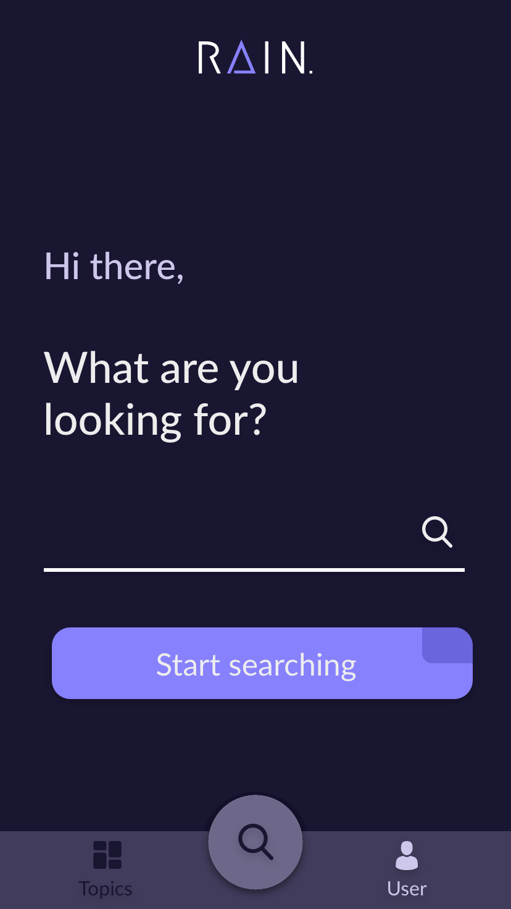
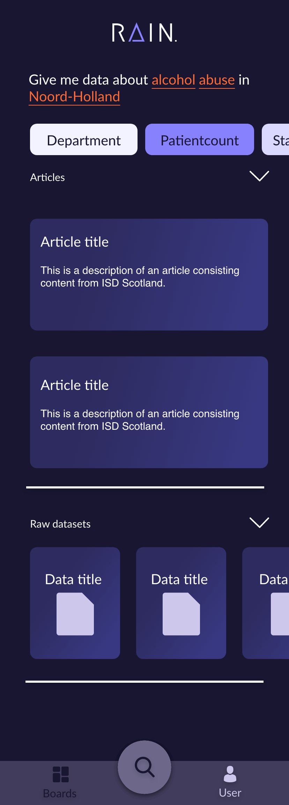
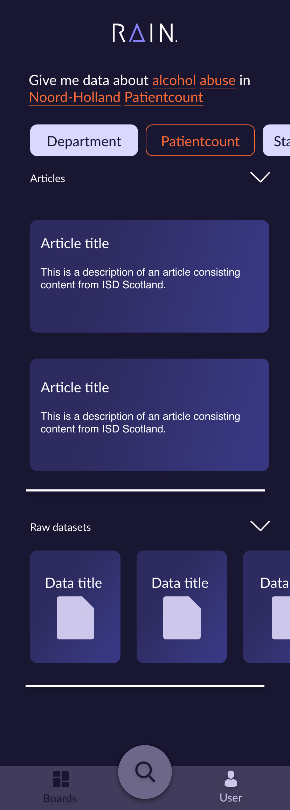
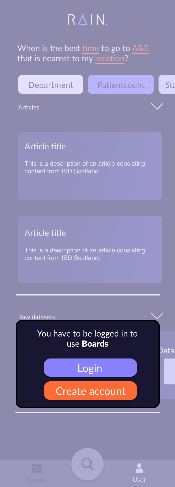
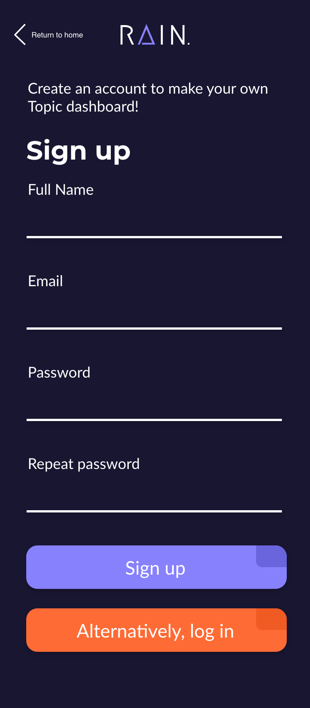
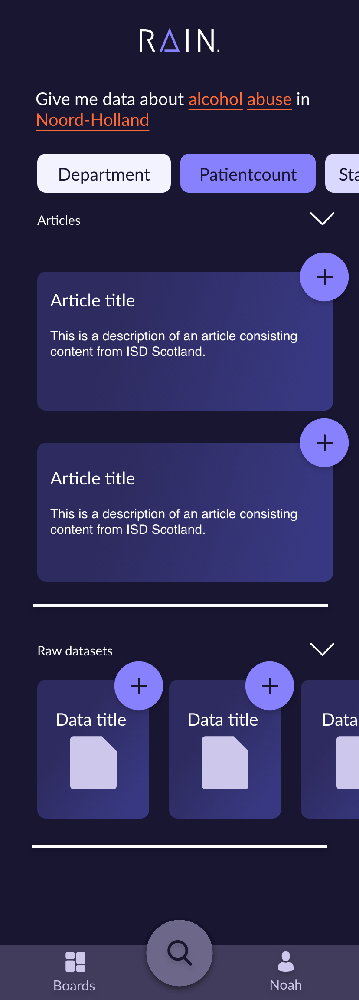
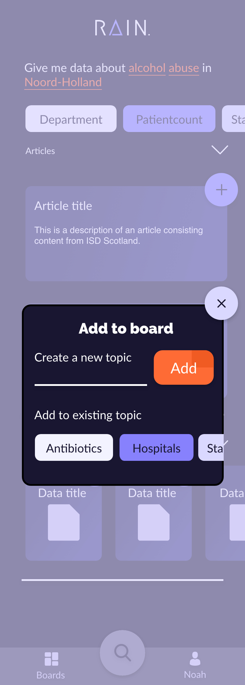
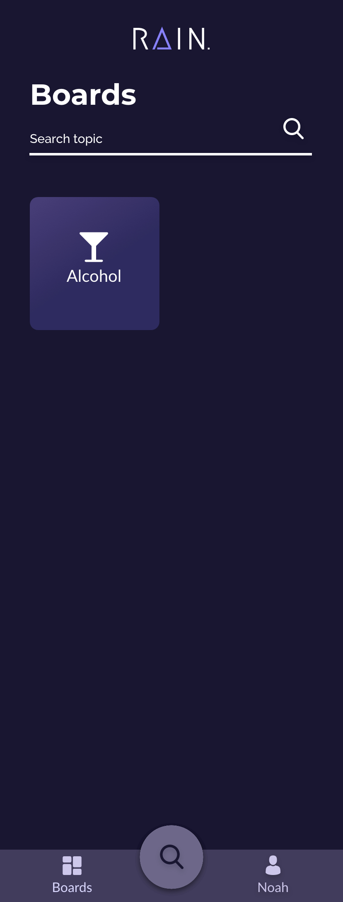
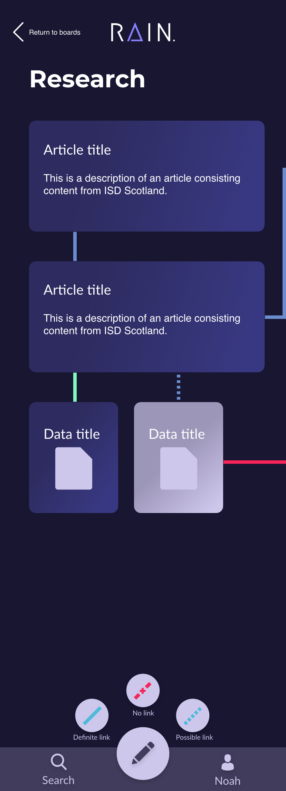

## User Scenario
Noah is a medical student writing his thesis and has to look into multiple (medical) datasets to support his findings. He sits in the school library on his laptop searching the few specific websites that provide this data. Noah had to follow a separate course to be able to search for the data using these websites, this is because the usability of the websites is very bad.

Noah downloads the app 'Rain', he heard is friend talk about this app. Noah is writing about alcohol abuse, and how it differs in different areas in the country. So he opens up the app and the first thing he does is type in what he's searching for: 'Alcohol abuse in Noord-Holland'.

|  |  |
|----------------------------------------|------------------------------------|

 The key words the system (Natural Language Processing) picks out are highlighted, so Noah now knows which words the app is using to search the data.

 Noah doesn't quite find what he's looking for, so he adds some keywords that the app suggests to him. The amount of articles and datasets decreases, which means that the search has become more specified.

Noah browses through the articles and wants to save some articles to get an overview. He clicks on the 'boards' button in the bottom-menu and is prompted with the message that he has to be logged in to use 'boards'. So Noah creates an account.

After Noah created his account he goes right back to where he left and adds an article to his Board.

|  |  |
|----------------------------------------|------------------------------------|

After Noah added the article to his boards he navigates to the boards page.

In the overview Noah sees the board he just created: 'Alcohol'. If he clicks on this board he sees the overview of the articles and datasets he collected for this topic.

On this page Noah can link the data he just collected. This is so he can see what data is linked to each other,
since it is important that he draws the right conclusions in his research.

